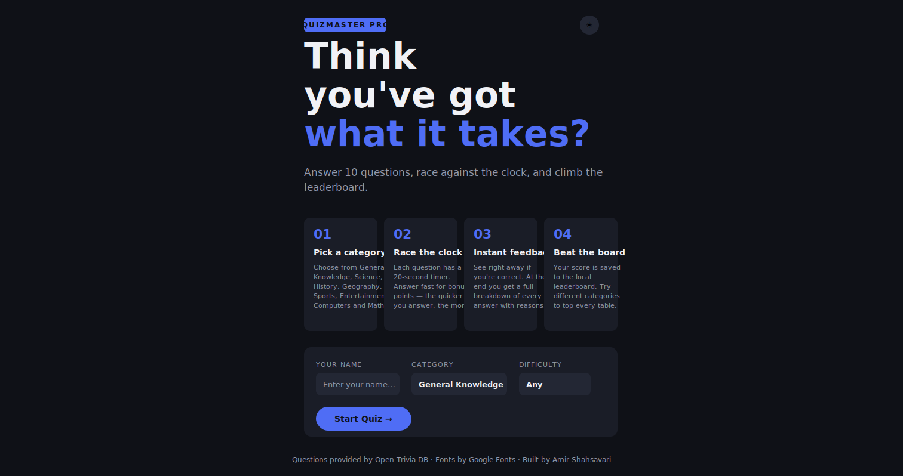
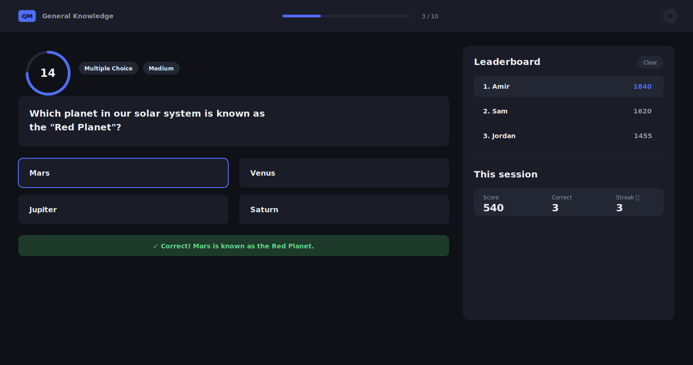
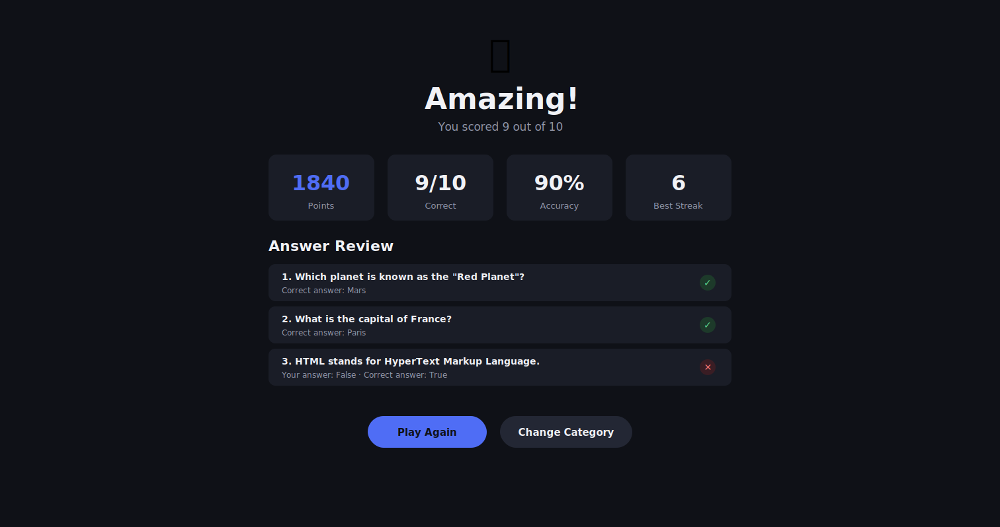

# QuizMaster Pro

An interactive online quiz application built with HTML, CSS, and JavaScript as part of Project 3.

## What it does

QuizMaster Pro fetches live trivia questions from the [Open Trivia Database API](https://opentdb.com) so every quiz is unique — no hard-coded question lists. Before starting, players enter their **name**, then pick a **category** (General Knowledge, Science, History, Geography, Sports, Entertainment, Computers or Mathematics) and a **difficulty** (Any, Easy, Medium, Hard). Players then race against a 20-second timer, earn bonus points for fast answers, and see their results on a local leaderboard.

## Value to users

- A quick, fresh trivia challenge every time — questions are pulled live so they never get repetitive.
- Players can tailor each session to their interests and skill level via the category/difficulty pickers.
- The leaderboard and live session stats add a competitive, game-like incentive to keep playing and improve.
- The end-of-quiz review gives instant, useful feedback on every question, including the correct answer.

## Features

- **Live questions** — powered by the Open Trivia DB API (no repeated questions)
- **Setup screen** — enter your name, choose a category and difficulty before each quiz
- **Eight categories** — General Knowledge, Science, History, Geography, Sports, Entertainment, Computers, Mathematics
- **Three question types** — Multiple Choice, True/False, and Fill-in-the-Blank
- **20-second timer** — with animated SVG ring; turns amber at 10s, red at 5s
- **Instant feedback** — correct/wrong animation on every answer
- **Speed scoring** — faster answers earn more points (up to 200 pts per question)
- **Streak tracking** — consecutive correct answers tracked per session
- **Local leaderboard** — top 10 scores saved in localStorage
- **Dark / Light mode** — toggle saved between sessions
- **Desktop two-column layout** — question on the left, leaderboard on the right
- **Fully responsive** — adapts across desktop, tablet (iPad) and phone screen sizes
- **Answer review** — full breakdown with correct answers shown at the end
- **How-To page** — instructions, name entry, category and difficulty selection

## Technologies Used

- HTML5
- CSS3 (custom properties, CSS Grid, Flexbox, media queries, keyframe animations)
- Vanilla JavaScript (ES6+, Fetch API, localStorage)
- [Open Trivia Database API](https://opentdb.com) — external source for questions
- [Google Fonts](https://fonts.google.com) — Syne (display) + DM Sans (body)

## File Structure

```
quiz-project/
├── index.html
├── README.md
└── assets/
    ├── css/
    │   └── style.css
    └── js/
        └── quiz.js
```

## How to Run Locally

1. Download or clone this repository
2. Open `index.html` in any modern browser
3. No build step or server required — it runs entirely in the browser

## Deployment (GitHub Pages)

1. Push all files to a GitHub repository
2. Go to **Settings → Pages**
3. Under **Source**, select `main` branch and `/ (root)` folder
4. Click **Save** — your live URL will appear within a minute

## Responsive Design

The layout was tested at three breakpoints to ensure it works well on:

- **Desktop** (1024px+) — two-column quiz layout with the leaderboard alongside the question
- **Tablet / iPad** (641px–1024px) — single-column quiz layout, sidebar moves below the question
- **Phone** (≤640px) — stacked answer buttons, single-column setup form, compact header

## Testing & Code Validation

The deployed site (`index.html`, `assets/css/style.css`) was checked against the official validators:

- **HTML — [W3C Nu Validator](https://validator.w3.org/nu/)**: 0 errors, 0 warnings.
  - Fixes applied: percent-encoded the favicon's inline SVG data URI (unencoded spaces are illegal in a `href`), changed the quiz layout's `<main>` to a `<div>` (a `<main>` cannot be nested inside a `<section>`), added a `role="timer"` to the countdown ring so its `aria-label` is valid, added a visually-hidden `<h2>` heading to the quiz section, corrected the How-To page's heading order (`<h3>` → `<h2>` for the step cards, since they follow an `<h1>` directly), and removed the unnecessary trailing `/` from void elements (`<meta>`, `<link>`, `<input>`, `<br>`) for clean HTML5.
- **CSS — [Jigsaw Validator](https://jigsaw.w3.org/css-validator/)**: 0 errors. (160 informational notes about CSS custom properties not being statically checked — expected and harmless for any stylesheet using `var()`.)
  - Fix applied: corrected an invalid 7-digit hex colour (`#6666805` → `#666c80`) in the light theme.
- **JavaScript**: reviewed manually for JSHint-style issues (no global Node/npm available in this environment to run JSHint directly) — code consistently uses `const`/`let`, strict equality (`===`/`!==`), semicolons, and has no implicit globals or unused variables.

### Manual testing checklist

- [x] Name field validation — Start Quiz is blocked and the name field highlights red until a name is entered
- [x] Each category/difficulty combination loads questions correctly (tested General Knowledge / Any)
- [x] Timer counts down and auto-submits as wrong when it reaches 0 (verified — question advanced automatically with the correct answer revealed)
- [x] Multiple choice and Fill-in-the-Blank questions both render and score correctly (True/False appears as a 2-option multiple choice question from the API)
- [x] Score, correct count and streak update live in the sidebar
- [x] Leaderboard saves and persists top 10 scores after a page refresh (confirmed on the live GitHub Pages deployment)
- [x] Dark/Light theme toggle works and persists after a page refresh
- [x] Layout checked on desktop, tablet (iPad) and phone screen sizes via CSS media query breakpoints (900px, 640px, 480px)
- [x] No broken links or console errors — verified on the live deployment

## External Sources & Attribution

| Source | Usage | URL |
|--------|-------|-----|
| Open Trivia DB API | Live quiz questions | https://opentdb.com |
| Google Fonts | Syne + DM Sans typefaces | https://fonts.google.com |

All other HTML, CSS, and JavaScript was written from scratch for this project.

## Screenshots

Live demo: https://amzish98-ui.github.io/quiz-project/

### How-To page


Welcome hero, 4-step "how it works" guide, and the setup form (name, category, difficulty). Sets expectations and lets players personalise the quiz before they start.

### Quiz page


Question card, 20-second countdown ring, answer grid, live score/streak sidebar and leaderboard. Keeps the player informed of time pressure, progress and ranking in real time.

### Results page


Final score, accuracy, best streak, and a full per-question answer review. Gives instant, actionable feedback so players can learn from mistakes.

## Author

Amir Shahsavari — Project 3, Learning People
